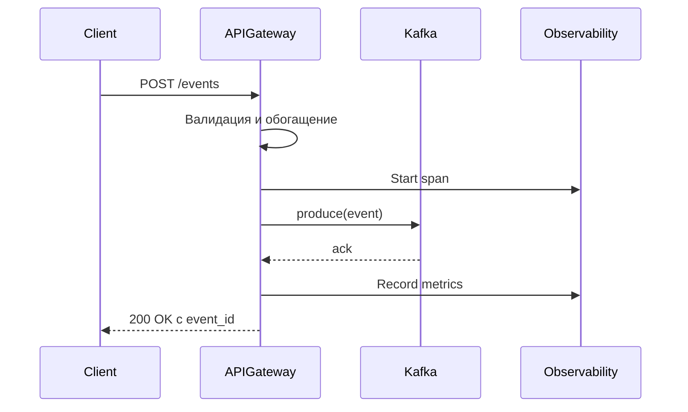

# API Gateway

## Назначение

API Gateway является единой точкой входа для приёма событий от внешних систем. Он обеспечивает валидацию, аутентификацию, rate limiting, обогащение событий и публикацию их в событийную шину (Kafka). Также предоставляет health checks и метрики для мониторинга.

## Архитектура

- **Фреймворк**: FastAPI (ASGI)
- **Инструментация**: OpenTelemetry для трассировки и метрик
- **Коммуникация**: Асинхронный Kafka producer
- **Хранилище**: Не хранит состояние, только транзитные данные

## Ключевые функции

1. **Приём событий** (`POST /events`)
   - Валидация схемы события (тип, severity, source, payload)
   - Генерация уникального `event_id`
   - Добавление метаданных (timestamp, correlation ID)
   - Публикация в топик Kafka `ras.events`

2. **Health checks** (`GET /health`)
   - Проверка соединения с Kafka и Redis
   - Возврат статуса сервиса и timestamp

3. **Метрики Prometheus** (`GET /metrics`)
   - Экспорт метрик через `prometheus-client`
   - Метрики: количество событий, ошибки, latency

4. **Middleware**
   - Добавление correlation ID в заголовки
   - Логирование запросов/ответов
   - Инструментация OpenTelemetry

## Конфигурация

### Переменные окружения

| Переменная | Описание | Значение по умолчанию |
|------------|----------|----------------------|
| `KAFKA_BOOTSTRAP_SERVERS` | Адреса брокеров Kafka | `localhost:9092` |
| `REDIS_HOST` | Хост Redis | `localhost` |
| `OTEL_EXPORTER_OTLP_ENDPOINT` | Endpoint OTLP | `http://jaeger:4317` |
| `OTEL_SERVICE_NAME` | Имя сервиса для трассировки | `api-gateway` |
| `API_KEY` | Ключ аутентификации (опционально) | - |
| `RATE_LIMIT_PER_MINUTE` | Лимит запросов в минуту | `1000` |

### Конфигурация Kafka

- Топик: `ras.events`
- Partitions: 3
- Replication factor: 2 (в production)
- Сериализация: JSON

## Обработка ошибок

- **400 Bad Request**: Невалидные данные события.
- **401 Unauthorized**: Отсутствует или неверный API ключ.
- **429 Too Many Requests**: Превышен rate limit.
- **500 Internal Server Error**: Ошибка при публикации в Kafka или сбое инфраструктуры.

## Метрики

- `ras_events_total` (counter) – количество принятых событий, разбивка по типу и severity.
- `ras_event_ingestion_latency_seconds` (histogram) – задержка обработки события.
- `ras_kafka_produce_errors_total` (counter) – ошибки при публикации в Kafka.
- `http_requests_total` – общее количество HTTP запросов.

## Пример запроса

```bash
curl -X POST http://localhost:8000/events \
  -H "Content-Type: application/json" \
  -H "X-API-Key: your-api-key" \
  -d '{
    "type": "payment_outage",
    "severity": "critical",
    "source": "payment_service",
    "payload": {"error_rate": 0.95, "region": "us-east-1"},
    "metadata": {"origin": "monitoring"}
  }'
```

Ответ:
```json
{
  "event_id": "a1b2c3d4-e5f6-7890-g1h2-i3j4k5l6m7n8",
  "status": "accepted",
  "message": "Event is being processed."
}
```

## Интеграция с Observability

- **Трассировка**: Каждый запрос создаёт span с атрибутами (event.type, event.severity).
- **Логи**: Структурированные JSON логи с correlation ID.
- **Метрики**: Экспортируются в Prometheus через `/metrics`.

## Масштабирование

API Gateway может быть развёрнут в нескольких экземплярах за балансировщиком нагрузки (например, Kubernetes Ingress). Поскольку он не хранит состояние, экземпляры независимы.

## Безопасность

- **Аутентификация**: Поддержка API ключей через заголовок `X-API-Key`.
- **TLS**: HTTPS для внешних подключений.
- **CORS**: Настройка разрешённых источников.
- **Rate Limiting**: Ограничение количества запросов на IP/ключ.

## Диаграмма последовательности



## Примечания для разработчиков

- Код находится в `ras_orchestrator/api_gateway/`
- Запуск: `uvicorn api_gateway.main:app --host 0.0.0.0 --port 8000`
- Тесты: `pytest tests/test_api_gateway.py`