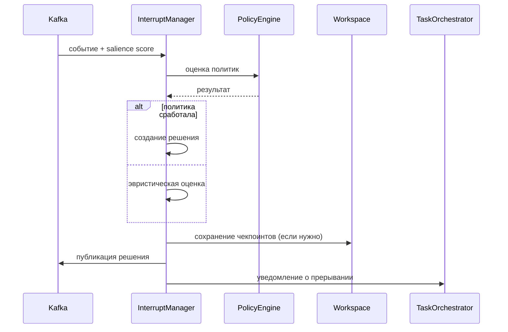

# Interrupt Manager

## Назначение

Interrupt Manager принимает решение о необходимости прерывания текущих задач в пользу обработки нового высокоприоритетного события. Он оценивает salience score, текущий режим системы, активные задачи и применяет политики прерывания. Также управляет чекпоинтами прерванных задач и политиками возобновления.

## Типы прерываний

- **Soft**: Мягкое прерывание с возможностью graceful shutdown задачи (например, завершение текущей итерации).
- **Hard**: Немедленное прерывание без сохранения состояния (только для экстренных случаев).
- **Delayed**: Прерывание с задержкой (например, через N секунд), чтобы дать задаче время завершиться.

## Архитектура

- **Политики**: Декларативные правила из Policy Engine (YAML).
- **Эвристики**: Дополнительные правила на основе salience score, режима, системных метрик.
- **Чекпоинты**: Сохранение состояния задачи в Workspace Service для возможности возобновления.
- **История решений**: Логирование всех решений для аудита и анализа.

## Процесс оценки

1. **Входные данные**:
   - Событие (event)
   - Salience score
   - Текущий режим системы (current_mode)
   - Список активных задач (active_tasks)

2. **Проверка политик**:
   - Policy Engine оценивает условия (conditions) всех активных политик прерывания.
   - Если политика срабатывает, возвращается решение с приоритетом, типом прерывания и другими параметрами.

3. **Эвристическая оценка** (если политики не сработали):
   - Матрица решений на основе salience score и режима.
   - Пример: если aggregated > 0.9 и risk > 0.8 → hard interrupt.

4. **Принятие решения**:
   - Формируется объект `InterruptDecision` с полями:
     - `should_interrupt` (bool)
     - `reason` (string)
     - `interrupt_type` (enum)
     - `priority` (int)
     - `delay_seconds` (int)
     - `checkpoint_required` (bool)

5. **Создание чекпоинтов** (если требуется):
   - Сохранение состояния каждой активной задачи в Redis.
   - TTL чекпоинта: 24 часа.

6. **Публикация решения**:
   - Решение публикуется в топик Kafka `ras.interrupt`.
   - Обновляется Workspace Service.

## Политики прерывания

Политики определяются в YAML-файлах (`policy_engine/policies/interrupt_policies.yaml`). Пример:

```yaml
- name: "high_risk_security"
  version: "1.0"
  enabled: true
  priority: 10
  conditions:
    all:
      - event.type: "security_alert"
      - salience.risk:
          gt: 0.8
  actions:
    action: "interrupt"
    reason: "Высокий риск безопасности"
    checkpoint: true
```

Условия поддерживают операторы: `gt`, `lt`, `eq`, `in`, `all`, `any`.

## Эвристики

Эвристики применяются, если ни одна политика не сработала:

| Условие | Решение | Тип | Приоритет | Чекпоинт |
|---------|---------|-----|-----------|----------|
| aggregated > 0.9 и risk > 0.8 | Прервать | Hard | 5 | Да |
| current_mode == critical и aggregated > 0.7 | Прервать | Hard | 4 | Да |
| aggregated > 0.8 | Прервать | Soft | 3 | Да |
| current_mode == elevated и risk > 0.6 | Прервать | Delayed (10s) | 2 | Нет |
| urgency > 0.8 и aggregated > 0.6 | Прервать | Soft | 2 | Нет |
| иначе | Не прерывать | - | - | - |

## Чекпоинты

Чекпоинт — это снимок состояния задачи на момент прерывания. Сохраняется в Redis с ключом `ras:workspace:checkpoint:{task_id}`.

Структура чекпоинта:
```json
{
  "task": { ... },
  "progress": 0.5,
  "state": "interrupted",
  "timestamp": "2024-01-01T12:00:00Z"
}
```

## Возобновление задач

Interrupt Manager предоставляет политику возобновления для прерванных задач:

- **Resume**: Возобновить с чекпоинта (если есть).
- **Restart**: Перезапустить задачу с начала (если чекпоинта нет).
- **Delay**: Задержка перед возобновлением.

Метод `get_resumption_policy(task_id)` возвращает рекомендацию.

## Конфигурация

### Переменные окружения

| Переменная | Описание | Значение по умолчанию |
|------------|----------|----------------------|
| `INTERRUPT_MANAGER_USE_POLICIES` | Использовать политики из Policy Engine | `true` |
| `INTERRUPT_CHECKPOINT_TTL_HOURS` | TTL чекпоинтов в часах | `24` |
| `INTERRUPT_HISTORY_SIZE` | Максимальный размер истории решений | `1000` |

### Конфигурационный файл

`interrupt_manager/config.yaml`:

```yaml
use_policies: true
checkpoint:
  ttl_hours: 24
  enabled: true
heuristics:
  enabled: true
  rules:
    - name: extreme_risk
      condition: "aggregated > 0.9 and risk > 0.8"
      interrupt_type: hard
      priority: 5
      checkpoint: true
```

## Метрики

- `ras_interrupt_decisions_total` (counter) – общее количество решений.
- `ras_interrupts_triggered_total` (counter) – количество сработавших прерываний.
- `ras_interrupt_type_distribution` (counter) – распределение по типам прерываний.
- `ras_checkpoint_created_total` (counter) – созданные чекпоинты.
- `ras_interrupt_evaluation_time_ms` (histogram) – время оценки.

## API

Interrupt Manager предоставляет REST API через Policy Engine:

- `GET /interrupt/stats` – статистика прерываний.
- `GET /interrupt/history` – история решений.
- `POST /interrupt/evaluate` – ручная оценка (для тестирования).
- `GET /interrupt/checkpoint/{task_id}` – получить чекпоинт задачи.

## Интеграция с Observability

- **Трассировка**: Span `interrupt_evaluation` с атрибутами (decision, reason, type).
- **Логи**: Запись каждого решения с деталями.
- **Метрики**: Экспорт в Prometheus.

## Диаграмма последовательности



## Примечания для разработчиков

- Код находится в `ras_orchestrator/interrupt_manager/`
- Основные классы: `InterruptManager`, `InterruptDecision`, `TaskCheckpoint`.
- Тесты: `pytest tests/test_interrupt_manager.py`
- Запуск consumer: `python -m interrupt_manager.consumer`