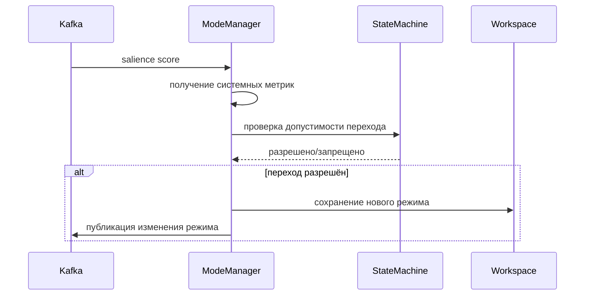

# Mode Manager

## Назначение

Mode Manager управляет глобальным режимом работы системы на основе salience score и системных метрик. Режим определяет общий уровень внимания системы и влияет на решения о прерываниях, распределение ресурсов и поведение других компонентов.

## Режимы системы

- **Low**: Низкая активность, система может выполнять фоновые задачи, прерывания маловероятны.
- **Normal**: Нормальный режим, баланс между производительностью и реактивностью.
- **Elevated**: Повышенный режим, система готовится к возможным критическим событиям, прерывания более вероятны.
- **Critical**: Критический режим, максимальное внимание, прерывания текущих задач для обработки высокоприоритетных событий.

## Архитектура

- **State Machine**: Конечный автомат, определяющий допустимые переходы между режимами.
- **Гистерезис**: Разные пороги для повышения и понижения режима, чтобы избежать колебаний.
- **Cooldown**: После выхода из critical режима система временно блокирует возврат в critical.
- **Корректировка порогов**: На основе системных метрик (CPU, latency, error rate) пороги автоматически адаптируются.

## Логика перехода

Переход определяется salience score (агрегированным) и текущим режимом.

### Пороги по умолчанию

| Режим   | Порог (score >=) | Гистерезис (up) | Гистерезис (down) |
|---------|------------------|-----------------|-------------------|
| Low     | 0.2              | -               | -0.03             |
| Normal  | 0.5              | -               | -0.03             |
| Elevated| 0.7              | +0.05           | -                 |
| Critical| 0.9              | +0.05           | -                 |

- **Повышение режима**: Требуется превышение порога + гистерезис.
- **Понижение режима**: Требуется снижение ниже порога - гистерезис.

### Матрица переходов

| From \ To | Low | Normal | Elevated | Critical |
|-----------|-----|--------|----------|----------|
| Low       | ✅   | ✅      | ❌        | ❌        |
| Normal    | ✅   | ✅      | ✅        | ✅        |
| Elevated  | ❌   | ✅      | ✅        | ✅        |
| Critical  | ❌   | ❌      | ✅        | ✅        |

## Системные метрики

Mode Manager может учитывать метрики системы для корректировки порогов:

- **CPU load** (0–1): Высокая нагрузка снижает пороги для elevated/critical.
- **Latency_ms**: Увеличение задержки повышает чувствительность.
- **Error_rate** (0–1): Высокий уровень ошибок понижает порог для critical.
- **Queue_depth**: Количество задач в очереди влияет на пороги.

Корректировка:
```
adjusted_threshold[mode] = base_threshold[mode] - load_factor * 0.1 - error_factor * 0.05
```

## Cooldown после Critical

После выхода из critical режима система остаётся в cooldown (по умолчанию 5 минут), в течение которого переход обратно в critical блокируется (вместо этого используется elevated). Это предотвращает "дребезг" при колебаниях salience score.

## Минимальный интервал между переходами

Чтобы избежать слишком частых переключений, между любыми переходами должен пройти минимум 30 секунд (настраивается).

## Ручное управление

Режим можно переключить вручную через API или CLI. При этом можно установить блокировку автоматических переходов (`manual_lock`).

## Конфигурация

### Переменные окружения

| Переменная | Описание | Значение по умолчанию |
|------------|----------|----------------------|
| `MODE_MANAGER_INITIAL_MODE` | Начальный режим | `normal` |
| `HYSTERESIS_UP` | Гистерезис для повышения | `0.05` |
| `HYSTERESIS_DOWN` | Гистерезис для понижения | `0.03` |
| `COOLDOWN_AFTER_CRITICAL_MINUTES` | Cooldown после critical (минуты) | `5` |
| `MIN_TRANSITION_INTERVAL_SECONDS` | Минимальный интервал между переходами | `30` |
| `USE_SYSTEM_METRICS` | Включить корректировку по метрикам | `true` |

### Конфигурационный файл

`mode_manager/config.yaml`:

```yaml
initial_mode: normal
base_thresholds:
  low: 0.2
  normal: 0.5
  elevated: 0.7
  critical: 0.9
hysteresis:
  up: 0.05
  down: 0.03
cooldown_after_critical_minutes: 5
min_transition_interval_seconds: 30
system_metrics:
  enabled: true
  weights:
    cpu_load: 0.1
    error_rate: 0.05
```

## Метрики

- `ras_mode_transitions_total` (counter) – количество переходов между режимами.
- `ras_current_mode` (gauge) – текущий режим (кодируется числом: low=1, normal=2, elevated=3, critical=4).
- `ras_mode_evaluation_time_ms` (histogram) – время оценки.
- `ras_cooldown_active` (gauge) – активен ли cooldown (0/1).

## API

Mode Manager предоставляет REST API через Policy Engine (или отдельный endpoint):

- `GET /mode/current` – текущий режим.
- `POST /mode/set` – ручное переключение (требует аутентификации).
- `GET /mode/history` – история переходов.

## Интеграция с Observability

- **Трассировка**: Span `mode_evaluation` с атрибутами (from, to, reason).
- **Логи**: Запись каждого перехода с причиной.
- **Метрики**: Экспорт в Prometheus.

## Диаграмма последовательности



## Примечания для разработчиков

- Код находится в `ras_orchestrator/mode_manager/`
- Основные классы: `ModeManager`, `ModeStateMachine`, `SystemMetrics`.
- Тесты: `pytest tests/test_mode_manager.py`
- Запуск consumer: `python -m mode_manager.consumer`