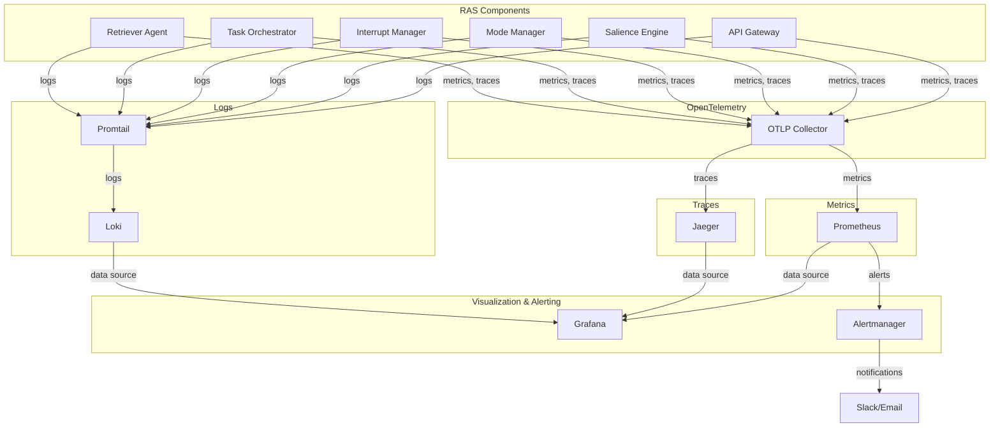

# Observability Stack

## Назначение

Observability Stack обеспечивает мониторинг, трассировку, логирование и алертинг для RAS-like оркестратора. Он позволяет отслеживать производительность, обнаруживать аномалии, анализировать инциденты и обеспечивать прозрачность работы системы.

## Компоненты стека

1. **OpenTelemetry**: Инструментация приложений (трассировка, метрики, логи).
2. **Prometheus**: Сбор и хранение метрик, алертинг.
3. **Grafana**: Визуализация метрик и логов, дашборды.
4. **Jaeger**: Распределённая трассировка.
5. **Loki**: Централизованное хранение и поиск логов.
6. **Alertmanager**: Управление алертами и нотификациями.

## Архитектура



## OpenTelemetry

### Инструментация

Каждый компонент RAS инструментирован с помощью OpenTelemetry Python SDK:

- **Трассировка**: Автоматическое создание spans для ключевых операций (приём события, вычисление salience, переход режима, прерывание, выполнение задачи).
- **Метрики**: Счётчики, гистограммы, gauge для бизнес- и системных метрик.
- **Логи**: Интеграция с структурированным логированием, добавление trace_id в логи.

### Конфигурация

Переменные окружения:
- `OTEL_EXPORTER_OTLP_ENDPOINT=http://jaeger:4317`
- `OTEL_SERVICE_NAME=api-gateway`
- `OTEL_TRACES_EXPORTER=otlp`
- `OTEL_METRICS_EXPORTER=prometheus`

### Пример span

```python
from opentelemetry import trace

tracer = trace.get_tracer(__name__)
with tracer.start_as_current_span("ingest_event") as span:
    span.set_attribute("event.type", event.type.value)
    span.set_attribute("event.severity", event.severity.value)
```

## Prometheus

### Метрики

Каждый компонент экспортирует метрики на endpoint `/metrics` (порт 9464). Prometheus собирает их каждые 15 секунд.

Ключевые метрики:

- `ras_events_total` (counter) – количество событий по типам.
- `ras_salience_score_distribution` (histogram) – распределение salience score.
- `ras_mode_transitions_total` (counter) – переходы режимов.
- `ras_interrupt_decisions_total` (counter) – решения о прерывании.
- `ras_tasks_created_total` (counter) – созданные задачи.
- `ras_agent_tasks_processed_total` (counter) – обработанные задачи агентом.
- `http_requests_total` (counter) – HTTP запросы к API Gateway.
- `redis_operations_total` (counter) – операции с Redis.

### Конфигурация Prometheus

Файл `observability/prometheus.yml` определяет targets для каждого компонента.

## Grafana

### Дашборды

Предопределённые дашборды находятся в `observability/grafana/dashboards/`:

1. **System Health**: Общее состояние системы (метрики компонентов, режим, ошибки).
2. **Event Flow**: Визуализация потока событий (количество, типы, задержки).
3. **Interrupt Analysis**: Анализ прерываний (решения, типы, причины).
4. **Task Performance**: Производительность задач (время выполнения, успешность).
5. **Infrastructure**: Мониторинг инфраструктуры (CPU, память, сеть).

### Источники данных

- Prometheus: `http://prometheus:9090`
- Jaeger: `http://jaeger:16686`
- Loki: `http://loki:3100`

## Jaeger

### Трассировка

Jaeger собирает трассировки от всех компонентов через OTLP. Позволяет видеть полный путь события через систему, анализировать задержки и зависимости.

### Интерфейс

Доступен по адресу `http://localhost:16686`. Можно искать traces по service name, operation, tags.

## Loki

### Логирование

Логи собираются с каждого компонента через Promtail, который читает log-файлы и отправляет в Loki. Логи структурированы в JSON формате.

### Конфигурация

- `observability/loki-config.yaml` – конфигурация Loki.
- `observability/promtail-config.yaml` – конфигурация Promtail.

### Поиск логов

В Grafana используется источник данных Loki для поиска логов по labels (service, level, trace_id).

## Alertmanager

### Правила алертинга

Определены в `observability/alert_rules.yml`. Примеры:

- **HighErrorRate**: Если error rate превышает 5% за 5 минут.
- **ModeStuckCritical**: Если система находится в critical режиме более 10 минут.
- **NoEvents**: Если события не поступают более 1 минуты (возможна недоступность).
- **HighLatency**: Если 95-й перцентиль latency превышает 1 секунду.

### Нотификации

Alertmanager отправляет уведомления в Slack, Email, PagerDuty (конфигурация в `observability/alertmanager.yml`).

## Развёртывание

Observability Stack разворачивается вместе с RAS через Docker Compose (см. `docker-compose.yml`). Все компоненты предварительно настроены.

### Порты

- Prometheus: 9090
- Grafana: 3000 (логин: admin, пароль: admin)
- Jaeger UI: 16686
- Loki: 3100
- Alertmanager: 9093

## Кастомизация

### Добавление новой метрики

1. Инструментировать код компонента с помощью OpenTelemetry Meter.
2. Убедиться, что метрика экспортируется в Prometheus.
3. При необходимости добавить график на дашборд Grafana.

### Добавление алерта

1. Добавить правило в `alert_rules.yml`.
2. Перезагрузить Prometheus (или подождать).
3. Настроить routing в Alertmanager.

### Расширение логирования

Использовать структурированное логирование с добавлением полей `service`, `trace_id`, `event_id`. Promtail автоматически подхватит новые log-файлы.

## Примечания для разработчиков

- Конфигурационные файлы находятся в `ras_orchestrator/observability/`
- Для локальной разработки можно запустить только нужные компоненты (например, только Prometheus и Grafana).
- Тесты на observability: `pytest tests/test_observability.py`