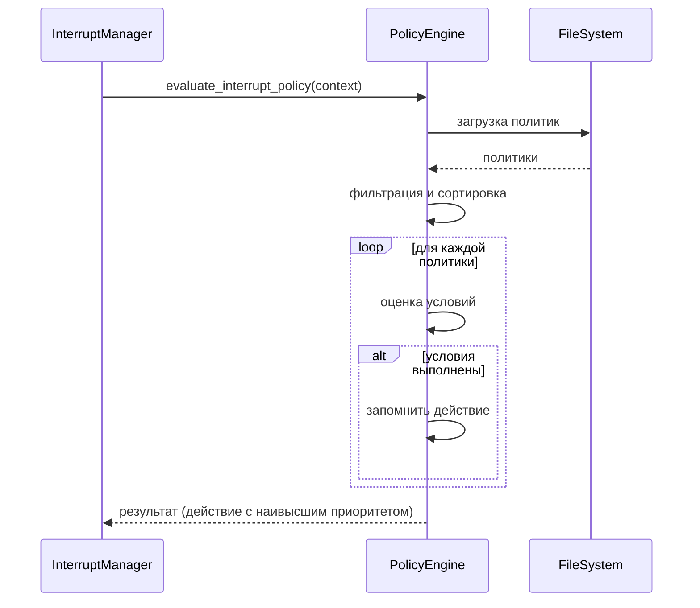

# Policy Engine

## Назначение

Policy Engine управляет декларативными политиками прерывания и переключения режимов. Политики определяются в YAML-файлах и загружаются при старте системы. Движок оценивает условия политик на основе контекста (событие, salience score, режим, активные задачи) и возвращает решения.

## Архитектура

- **DSL (Domain Specific Language)**: YAML-формат с поддержкой логических операторов (`all`, `any`), сравнений (`gt`, `lt`, `eq`, `in`), и ссылок на данные контекста.
- **Загрузка политик**: Из директории `policy_engine/policies/` (файлы `*.yaml`).
- **Версионирование**: Каждая политика имеет версию, можно управлять активными версиями.
- **Hot reload**: Возможность обновления политик без перезапуска (опционально).
- **Web UI**: Статический интерфейс для просмотра и редактирования политик (в будущем).

## Формат политики

Политики группируются в файлах по категориям:

```yaml
version: "2.0"
description: "Политики прерывания задач с расширенным DSL"
policies:
  - name: "high_risk_security"
    version: "1.0"
    description: "Прерывание при высоком риске безопасности"
    enabled: true
    priority: 10
    tags: ["security", "high_priority"]
    conditions:
      all:
        - event.type: "security_alert"
        - salience.risk:
            gt: 0.8
    actions:
      action: "interrupt"
      reason: "Высокий риск безопасности"
      checkpoint: true
    metadata:
      created: "2024-01-01"
      author: "security_team"
```

### Структура политики

- **name**: Уникальный идентификатор политики.
- **version**: Версия политики (семантическое версионирование).
- **enabled**: Включена ли политика.
- **priority**: Приоритет (чем выше, тем раньше проверяется).
- **tags**: Метки для категоризации.
- **conditions**: Условия, которые должны быть выполнены.
- **actions**: Действия, выполняемые при срабатывании.
- **metadata**: Дополнительные метаданные (автор, дата создания, категория).

### Условия (conditions)

Поддерживаются операторы:

- **Простые сравнения**:
  ```yaml
  salience.risk:
    gt: 0.8
  ```
  Доступные операторы: `gt`, `lt`, `eq`, `gte`, `lte`, `neq`, `in`, `not_in`.

- **Логические операторы**:
  - `all`: Все подусловия должны быть истинны.
  - `any`: Хотя бы одно подусловие истинно.
  - `not`: Отрицание условия.

- **Доступные поля контекста**:
  - `event.type`, `event.severity`, `event.source`, `event.payload.*`
  - `salience.relevance`, `salience.novelty`, `salience.risk`, `salience.urgency`, `salience.uncertainty`, `salience.aggregated`
  - `current_mode` (значение режима системы)
  - `active_task_count` (количество активных задач)
  - `system_metrics.cpu_load`, `system_metrics.latency_ms`, `system_metrics.error_rate`, `system_metrics.queue_depth`

### Действия (actions)

Зависят от типа политики:

- **Политики прерывания** (`interrupt_policies.yaml`):
  - `action`: `interrupt` или `delay`
  - `reason`: Текстовое объяснение
  - `checkpoint`: boolean (требуется ли чекпоинт)
  - `interrupt_type`: `soft`, `hard`, `delayed`
  - `delay_seconds`: Задержка в секундах (для delayed)
  - `priority`: Приоритет прерывания

- **Политики режимов** (`mode_policies.yaml`):
  - `target_mode`: `low`, `normal`, `elevated`, `critical`
  - `reason`: Текстовое объяснение
  - `hysteresis`: Дополнительный гистерезис (опционально)

## Процесс оценки

1. **Загрузка контекста**: Сбор данных о событии, salience score, текущем режиме, активных задачах, системных метриках.
2. **Фильтрация политик**: Отбираются только включённые политики, отсортированные по приоритету (убывание).
3. **Проверка условий**: Для каждой политики вычисляются условия. Если условие истинно, политика срабатывает.
4. **Выполнение действий**: Возвращается действие (например, решение о прерывании) и политика считается "применённой".
5. **Агрегация результатов**: Если сработало несколько политик, выбирается действие с наивысшим приоритетом (или комбинируется).

## Конфигурация

### Переменные окружения

| Переменная | Описание | Значение по умолчанию |
|------------|----------|----------------------|
| `POLICY_ENGINE_POLICIES_DIR` | Директория с YAML-файлами политик | `policy_engine/policies/` |
| `POLICY_ENGINE_HOT_RELOAD` | Включить hot reload при изменении файлов | `false` |
| `POLICY_ENGINE_LOG_LEVEL` | Уровень логирования | `INFO` |

### Конфигурационный файл

`policy_engine/config.yaml`:

```yaml
policies_dir: policy_engine/policies/
hot_reload: false
default_priority: 0
evaluation_timeout_ms: 1000
logging:
  level: INFO
  format: json
```

## Метрики

- `ras_policy_evaluations_total` (counter) – количество оценок политик.
- `ras_policy_matches_total` (counter) – количество срабатываний политик.
- `ras_policy_evaluation_time_ms` (histogram) – время оценки.
- `ras_policy_errors_total` (counter) – ошибки при загрузке или оценке.

## API

Policy Engine предоставляет REST API через FastAPI (отдельный сервис или встроенный в API Gateway):

- `GET /policies` – список всех политик.
- `GET /policies/{name}` – детали политики.
- `POST /policies` – создание новой политики (требует аутентификации).
- `PUT /policies/{name}` – обновление политики.
- `DELETE /policies/{name}` – удаление политики (деактивация).
- `POST /evaluate` – оценка контекста (для тестирования).

## Web UI

Статический веб-интерфейс доступен по адресу `http://localhost:8000/policy-ui/` (если запущен API Gateway). Позволяет просматривать политики, фильтровать по тегам, включать/выключать, редактировать (в будущем).

## Интеграция с Observability

- **Трассировка**: Span `policy_evaluation` с атрибутами (policy_name, matched).
- **Логи**: Запись срабатываний политик с деталями.
- **Метрики**: Экспорт в Prometheus.

## Диаграмма последовательности



## Примечания для разработчиков

- Код находится в `ras_orchestrator/policy_engine/`
- Основные классы: `PolicyEngine`, `Policy`, `ConditionEvaluator`.
- Тесты: `pytest tests/test_policy_engine.py`
- Запуск API: `uvicorn policy_engine.api:app --host 0.0.0.0 --port 8001`
- Формат политик должен быть валидным YAML, поддерживается JSON Schema для проверки.