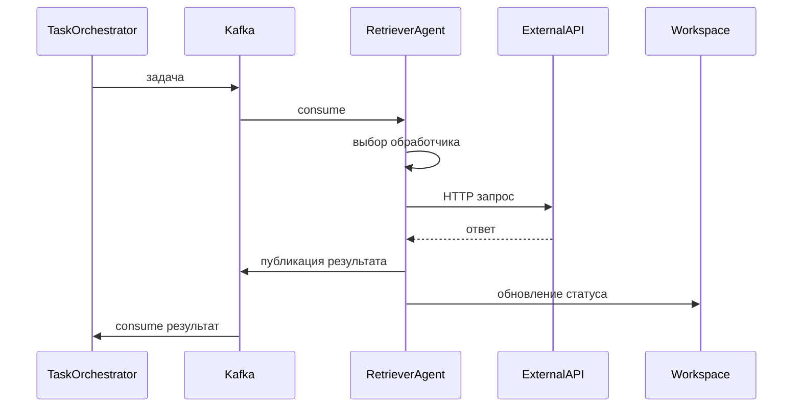

# Retriever Agent

## Назначение

Retriever Agent — это базовый агент, выполняющий задачи, созданные Task Orchestrator. Он демонстрирует интеграцию агентов в систему RAS и может быть расширен или заменён другими специализированными агентами. Основная функция — получение информации из внешних источников (например, API, базы данных) и возврат результата.

## Архитектура

- **Потребитель задач**: Подписывается на топик Kafka `ras.tasks.retriever`.
- **Исполнитель**: Выполняет задачу, вызывая соответствующий обработчик (handler) на основе типа задачи.
- **Публикатор результатов**: Отправляет результат выполнения в топик `ras.results`.
- **Статусы**: Обновляет статус задачи в Workspace Service.

## Типы задач

Retriever Agent поддерживает следующие типы задач (может быть расширен):

1. **fetch_data**: Получить данные из внешнего API.
   - Параметры: `url`, `method`, `headers`, `body`.
   - Результат: Ответ API (status_code, body).

2. **search**: Поиск информации в индексе (например, Elasticsearch).
   - Параметры: `query`, `index`, `size`.
   - Результат: Список документов.

3. **aggregate**: Агрегация данных из нескольких источников.
   - Параметры: `sources`, `aggregation_function`.
   - Результат: Агрегированное значение.

4. **notify**: Отправка уведомления (например, email, Slack).
   - Параметры: `channel`, `message`, `recipients`.
   - Результат: Статус отправки.

## Процесс выполнения

1. **Получение задачи**: Из топика Kafka `ras.tasks.retriever`.
2. **Валидация**: Проверка обязательных параметров, типа задачи.
3. **Выбор обработчика**: Сопоставление типа задачи с зарегистрированным обработчиком.
4. **Выполнение**:
   - Обработчик выполняет логику (HTTP запрос, поиск, вычисления).
   - Обработка ошибок и таймаутов.
5. **Формирование результата**:
   - Успех: `{"status": "completed", "result": {...}, "metadata": {...}}`
   - Ошибка: `{"status": "failed", "error": "...", "retryable": true/false}`
6. **Публикация результата**: В топик `ras.results`.
7. **Обновление Workspace Service**: Обновление статуса задачи.

## Обработка ошибок

- **Retryable ошибки**: Сетевые таймауты, временная недоступность сервиса, rate limiting. Агент помечает задачу как `failed` с флагом `retryable: true`, чтобы Task Orchestrator мог повторить.
- **Non-retryable ошибки**: Невалидные параметры, отсутствие доступа, бизнес-логические ошибки. Задача завершается с `retryable: false`.
- **Таймауты**: Максимальное время выполнения задачи (по умолчанию 30 секунд). При превышении задача прерывается.

## Конфигурация

### Переменные окружения

| Переменная | Описание | Значение по умолчанию |
|------------|----------|----------------------|
| `RETRIEVER_AGENT_CONCURRENCY` | Количество параллельно обрабатываемых задач | `5` |
| `RETRIEVER_AGENT_TIMEOUT_SECONDS` | Таймаут выполнения задачи (секунды) | `30` |
| `RETRIEVER_AGENT_MAX_RETRIES` | Максимальное количество локальных повторных попыток | `2` |
| `RETRIEVER_AGENT_LOG_LEVEL` | Уровень логирования | `INFO` |

### Конфигурационный файл

`retriever_agent/config.yaml`:

```yaml
concurrency: 5
timeout_seconds: 30
max_retries: 2
handlers:
  fetch_data:
    class: retriever_agent.handlers.FetchDataHandler
    default_headers:
      User-Agent: RAS-Retriever/1.0
  search:
    class: retriever_agent.handlers.SearchHandler
    elasticsearch_host: http://localhost:9200
  aggregate:
    class: retriever_agent.handlers.AggregateHandler
  notify:
    class: retriever_agent.handlers.NotifyHandler
    slack_webhook: ${SLACK_WEBHOOK}
```

## Метрики

- `ras_agent_tasks_processed_total` (counter) – количество обработанных задач.
- `ras_agent_task_duration_seconds` (histogram) – время выполнения задачи.
- `ras_agent_task_errors_total` (counter) – количество ошибок (с разбивкой по типу).
- `ras_agent_queue_size` (gauge) – размер внутренней очереди задач.

## Расширение агента

Чтобы добавить новый тип задачи, необходимо:

1. Создать класс-обработчик, наследуемый от `BaseHandler` и реализующий метод `execute`.
2. Зарегистрировать обработчик в конфигурации.
3. Обновить схему параметров задачи (при необходимости).

Пример обработчика:

```python
from retriever_agent.handlers import BaseHandler

class CustomHandler(BaseHandler):
    def execute(self, parameters: Dict) -> Dict:
        # логика выполнения
        return {"result": "success"}
```

## Интеграция с Observability

- **Трассировка**: Span `agent_execute` с атрибутами (task_id, handler_type, status).
- **Логи**: Запись начала и завершения выполнения задачи, ошибок.
- **Метрики**: Экспорт в Prometheus.

## Диаграмма последовательности



## Примечания для разработчиков

- Код находится в `ras_orchestrator/retriever_agent/`
- Основные классы: `RetrieverAgent`, `BaseHandler`, `TaskConsumer`.
- Тесты: `pytest tests/test_retriever_agent.py`
- Запуск consumer: `python -m retriever_agent.consumer`