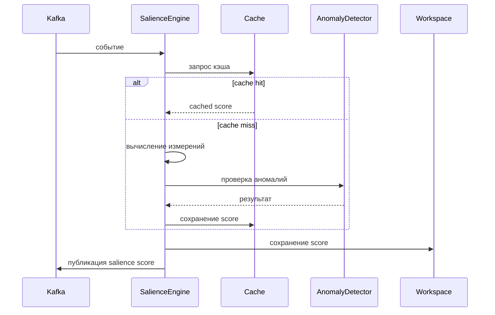

# Salience Engine

## Назначение

Salience Engine вычисляет значимость (salience) входящих событий по пяти измерениям: релевантность, новизна, риск, срочность, неопределённость. На основе этих измерений формируется агрегированный salience score (0–1), который используется для принятия решений о переключении режимов и прерываниях.

## Архитектура

- **Базовый движок**: Детерминированные правила на основе severity и типа события.
- **Расширенный движок**: Кэширование, ML-аномалии, внешний контекст, настраиваемые веса.
- **Конфигурация**: Веса измерений, пороги, включение/выключение функций через переменные окружения.

## Измерения значимости

1. **Релевантность (relevance)**
   - Насколько событие соответствует целям системы.
   - Зависит от severity: low=0.2, medium=0.5, high=0.8, critical=1.0.
   - Может быть скорректирована на основе типа события.

2. **Новизна (novelty)**
   - Насколько событие отличается от предыдущих.
   - Заглушка: 0.3 (планируется реализация на основе similarity cache).

3. **Риск (risk)**
   - Потенциальный ущерб от события.
   - Высокий риск для security_alert (0.9), payment_outage (0.8), остальные 0.4.

4. **Срочность (urgency)**
   - Требует ли событие немедленного реагирования.
   - Зависит от severity: high/critical = 0.9, иначе 0.4.

5. **Неопределённость (uncertainty)**
   - Обратная уверенности (confidence) из payload.
   - `uncertainty = 1.0 - confidence` (по умолчанию confidence=0.8).

## Агрегация

Агрегированный score вычисляется как взвешенная сумма:

```
aggregated = relevance * w_r + novelty * w_n + risk * w_rk + urgency * w_u + uncertainty * w_unc
```

Веса по умолчанию:
- relevance: 0.3
- novelty: 0.2
- risk: 0.25
- urgency: 0.15
- uncertainty: 0.1

## Расширенные возможности

### Кэширование (SimilarityCache)
- Кэширует вычисленные scores для похожих событий (по типу, severity, payload).
- Уменьшает нагрузку при повторяющихся событиях.
- TTL кэша: 5 минут.

### Детекция аномалий (AnomalyDetector)
- Использует статистику (z-score) для обнаружения аномальных salience scores.
- Логирует предупреждения при обнаружении.
- Может триггерить дополнительные действия (например, уведомление).

### Внешний контекст
- Интеграция с внешними системами (мониторинг, инциденты) для корректировки весов.
- Планируется в фазе 2.

### Настраиваемые веса по типам событий
- Можно задать разные веса для разных типов событий (например, для security_alert увеличить вес риска).

## Конфигурация

### Переменные окружения

| Переменная | Описание | Значение по умолчанию |
|------------|----------|----------------------|
| `SALIENCE_ENGINE_TYPE` | Тип движка (`basic` или `enhanced`) | `enhanced` |
| `SALIENCE_WEIGHTS` | JSON с весами измерений | `{"relevance":0.3,"novelty":0.2,"risk":0.25,"urgency":0.15,"uncertainty":0.1}` |
| `USE_CACHE` | Включить кэширование | `true` |
| `USE_ANOMALY_DETECTION` | Включить детекцию аномалий | `true` |
| `CACHE_TTL_SECONDS` | TTL кэша в секундах | `300` |

### Конфигурационный файл

Можно использовать YAML-конфиг `salience_engine/config.yaml`:

```yaml
engine_type: enhanced
weights:
  relevance: 0.3
  novelty: 0.2
  risk: 0.25
  urgency: 0.15
  uncertainty: 0.1
cache:
  enabled: true
  ttl: 300
anomaly_detection:
  enabled: true
  z_score_threshold: 2.5
```

## Метрики

- `ras_salience_score_distribution` (histogram) – распределение агрегированного score.
- `ras_salience_computation_time_ms` (histogram) – время вычисления.
- `ras_salience_cache_hits_total` (counter) – попадания в кэш.
- `ras_salience_anomalies_total` (counter) – обнаруженные аномалии.

## Пример работы

1. Событие `payment_outage` с severity `critical` поступает в движок.
2. Вычисляются измерения:
   - relevance = 1.0 (critical)
   - novelty = 0.3
   - risk = 0.8
   - urgency = 0.9
   - uncertainty = 0.2 (confidence=0.8)
3. Агрегированный score = 0.3*1.0 + 0.2*0.3 + 0.25*0.8 + 0.15*0.9 + 0.1*0.2 = 0.3 + 0.06 + 0.2 + 0.135 + 0.02 = **0.715**
4. Score публикуется в топик `ras.salience`.

## Интеграция с Observability

- **Трассировка**: Span `salience_compute` с атрибутами измерений и временем вычисления.
- **Логи**: Запись вычисленного score с event_id.
- **Метрики**: Экспорт в Prometheus.

## Масштабирование

Salience Engine может быть запущен в нескольких экземплярах, каждый из которых подписан на топик `ras.events` через consumer group. Kafka обеспечивает распределение нагрузки.

## Диаграмма последовательности



## Примечания для разработчиков

- Код находится в `ras_orchestrator/salience_engine/`
- Основные классы: `SalienceEngine`, `EnhancedSalienceEngine`, `AdvancedScoring`, `SimilarityCache`, `AnomalyDetector`.
- Тесты: `pytest tests/test_salience_engine.py`
- Запуск consumer: `python -m salience_engine.consumer`