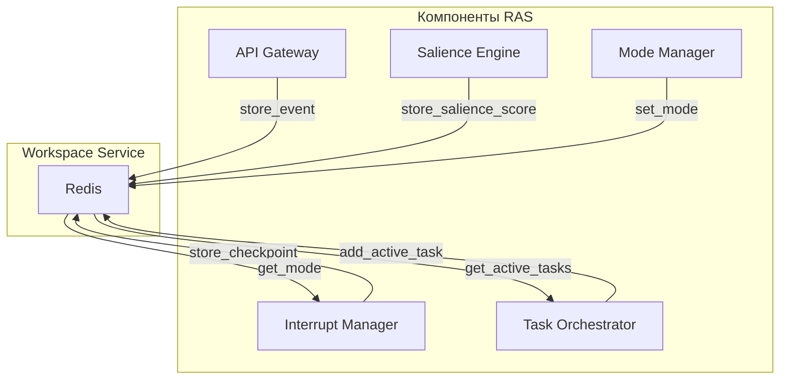

# Workspace Service

## Назначение

Workspace Service предоставляет общее рабочее пространство для хранения состояния системы, используя Redis как быстрое key-value хранилище. Он служит централизованным местом для обмена данными между компонентами RAS, обеспечивая консистентность и доступность.

## Архитектура

- **Хранилище**: Redis (in-memory data store) с возможностью persistence (AOF).
- **Структуры данных**: Strings, Hashes, Lists, Pub/Sub.
- **Префикс ключей**: `ras:workspace:` для изоляции.
- **Клиент**: Redis Python client (`redis-py`) с поддержкой connection pooling.

## Хранимые данные

### 1. События (Events)
- Ключ: `ras:workspace:event:{event_id}`
- Тип: String (JSON)
- TTL: 24 часа (настраивается)
- Содержимое: Полное событие (сериализованный объект Event).

### 2. Salience scores
- Ключ: `ras:workspace:salience:{event_id}`
- Тип: String (JSON)
- TTL: 24 часа
- Содержимое: SalienceScore (релевантность, новизна, риск, срочность, неопределённость, агрегированный).

### 3. Режим системы (System mode)
- Ключ: `ras:workspace:system:mode`
- Тип: String
- Значение: `low`, `normal`, `elevated`, `critical`
- Обновляется Mode Manager.

### 4. Активные задачи (Active tasks)
- Ключ: `ras:workspace:tasks:active`
- Тип: Hash
- Поля: `task_id` -> JSON задачи (Task object)
- Используется Task Orchestrator для отслеживания выполняющихся задач.

### 5. Чекпоинты (Checkpoints)
- Ключ: `ras:workspace:checkpoint:{task_id}`
- Тип: String (JSON)
- TTL: 24 часа (настраивается)
- Содержимое: Состояние задачи на момент прерывания.

### 6. История решений о прерываниях (Interrupt decisions)
- Ключ: `ras:workspace:interrupt:history`
- Тип: List (ограниченная по размеру)
- Содержимое: Сериализованные объекты InterruptDecision (последние N решений).

### 7. Публикация обновлений (Pub/Sub)
- Каналы:
  - `ras:workspace:updates` – общие обновления (режим, события).
  - `ras:workspace:interrupt_decisions` – решения о прерываниях.
  - `ras:workspace:task_updates` – изменения статусов задач.

## API методов

Workspace Service предоставляет клиентский класс `WorkspaceService` с методами:

### Хранение и получение событий
- `store_event(event: Dict, ttl: Optional[int])` – сохранить событие.
- `get_event(event_id: str) -> Optional[Dict]` – получить событие.

### Salience scores
- `store_salience_score(event_id: str, score: Dict)`
- `get_salience_score(event_id: str) -> Optional[Dict]`

### Режим системы
- `set_mode(mode: str)`
- `get_mode() -> str`

### Активные задачи
- `add_active_task(task_id: str, task_data: Dict)`
- `remove_active_task(task_id: str)`
- `get_active_tasks() -> Dict[str, Dict]`

### Чекпоинты
- `store_checkpoint(task_id: str, checkpoint_data: Dict, ttl: int)`
- `get_checkpoint(task_id: str) -> Optional[Dict]`

### Pub/Sub
- `publish_update(channel: str, message: Dict)`
- Подписка осуществляется компонентами напрямую через Redis client.

### Health check
- `health() -> bool` – проверка соединения с Redis.

## Конфигурация

### Переменные окружения

| Переменная | Описание | Значение по умолчанию |
|------------|----------|----------------------|
| `REDIS_HOST` | Хост Redis | `localhost` |
| `REDIS_PORT` | Порт Redis | `6379` |
| `REDIS_DB` | Номер базы данных | `0` |
| `REDIS_PASSWORD` | Пароль (если требуется) | - |
| `REDIS_SSL` | Использовать SSL | `false` |
| `KEY_PREFIX` | Префикс ключей | `ras:workspace:` |
| `DEFAULT_TTL_HOURS` | TTL по умолчанию в часах | `24` |

### Конфигурационный файл

`workspace_service/config.yaml`:

```yaml
redis:
  host: localhost
  port: 6379
  db: 0
  password: null
  ssl: false
key_prefix: "ras:workspace:"
default_ttl_hours: 24
pubsub_channels:
  - updates
  - interrupt_decisions
  - task_updates
```

## Обработка ошибок

- **Соединение с Redis**: При недоступности Redis клиент пытается переподключиться с экспоненциальной задержкой.
- **Таймауты**: Настройка timeout на операции (по умолчанию 5 секунд).
- **Fallback**: Если Redis недоступен, компоненты могут работать в degraded mode (например, использовать локальный кэш), но это требует дополнительной реализации.

## Метрики

- `ras_redis_operations_total` (counter) – количество операций (get/set/hset и т.д.).
- `ras_redis_latency_seconds` (histogram) – задержка операций.
- `ras_redis_connection_errors_total` (counter) – ошибки соединения.
- `ras_workspace_keys_count` (gauge) – количество ключей с префиксом.

## Масштабирование

- **Redis Cluster**: Для горизонтального масштабирования можно использовать Redis Cluster с шардированием данных.
- **Репликация**: Master-slave репликация для повышения доступности и чтения.
- **Persistent storage**: RDB snapshots и AOF для durability.

## Интеграция с Observability

- **Трассировка**: Span для каждой операции Redis (если включено инструментирование).
- **Логи**: Логирование ошибок соединения и медленных операций.
- **Метрики**: Экспорт в Prometheus через отдельный endpoint или через Redis exporter.

## Диаграмма взаимодействия



## Примечания для разработчиков

- Код находится в `ras_orchestrator/workspace_service/`
- Основной класс: `WorkspaceService`.
- Тесты: `pytest tests/test_workspace_service.py`
- Зависимости: `redis` (пакет `redis-py`).
- Для локальной разработки можно использовать Docker-контейнер Redis.