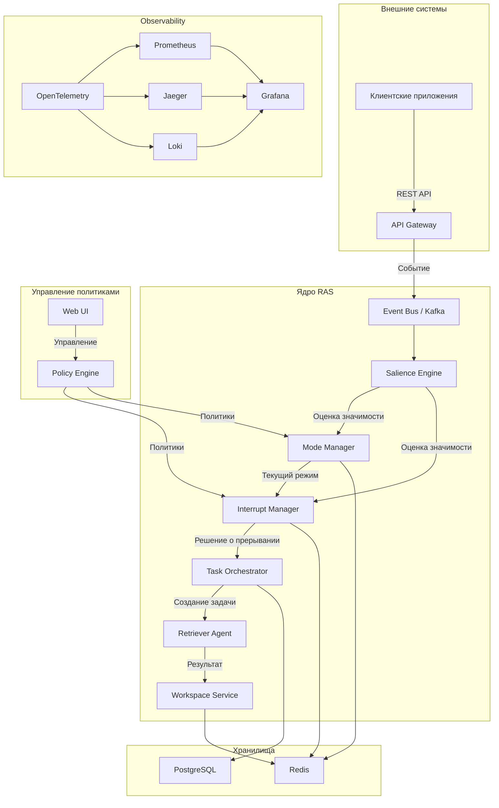
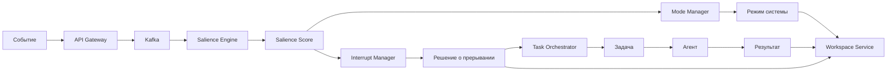

# Архитектурный обзор RAS-like оркестратора

## Введение

RAS-like оркестратор — это система, реализующая принципы Reticular Activating System (RAS) для селективного внимания и прерывания задач в распределённых системах. Она автоматически оценивает значимость входящих событий, управляет глобальным режимом работы и принимает решения о прерывании текущих задач в пользу более важных.

## Высокоуровневая архитектура

Система построена по микросервисной архитектуре с использованием событийного шины (Apache Kafka) для асинхронной коммуникации между компонентами. Все компоненты являются stateless, состояние хранится в Redis (рабочее пространство) и PostgreSQL (постоянное хранилище).

### Диаграмма архитектуры (Mermaid)



## Поток событий (Event Flow)

1. **Приём события**: Внешняя система отправляет событие через REST API в API Gateway.
2. **Публикация в шину**: API Gateway публикует событие в топик Kafka `ras.events`.
3. **Оценка значимости**: Salience Engine потребляет событие, вычисляет salience score по пяти измерениям (релевантность, новизна, риск, срочность, неопределённость) и публикует результат в топик `ras.salience`.
4. **Управление режимом**: Mode Manager на основе salience score определяет глобальный режим системы (low, normal, elevated, critical) и сохраняет его в Redis.
5. **Решение о прерывании**: Interrupt Manager оценивает, нужно ли прервать текущие задачи. Использует политики из Policy Engine и эвристики.
6. **Оркестрация задач**: Если прерывание требуется, Task Orchestrator создаёт новую задачу и назначает её агенту (например, Retriever Agent).
7. **Выполнение задачи**: Агент выполняет задачу, сохраняет результат в Workspace Service (Redis) и обновляет статус.
8. **Наблюдаемость**: Все этапы инструментированы с помощью OpenTelemetry, метрики собираются в Prometheus, логи — в Loki, трассировки — в Jaeger.

## Поток данных (Data Flow)



## Компоненты системы

### 1. API Gateway
- **Назначение**: Единая точка входа для приёма событий от внешних систем.
- **Технологии**: FastAPI, OpenTelemetry, Kafka producer.
- **Ключевые endpoints**:
  - `POST /events` – приём события.
  - `GET /health` – проверка здоровья.
  - `GET /metrics` – метрики Prometheus.
- **Безопасность**: Поддержка аутентификации через API ключи (планируется), CORS, rate limiting.

### 2. Salience Engine
- **Назначение**: Вычисление значимости события по пяти измерениям.
- **Алгоритмы**:
  - Базовый scoring на основе severity и типа события.
  - Расширенный scoring с кэшированием, детекцией аномалий, ML-моделями.
- **Конфигурация**: Веса измерений настраиваются через переменные окружения или конфигурационные файлы.
- **Метрики**: Распределение salience score, время вычисления, hit/miss кэша.

### 3. Mode Manager
- **Назначение**: Управление глобальным режимом системы (state machine).
- **Режимы**: low, normal, elevated, critical.
- **Логика**: Гистерезис, cooldown после critical, корректировка порогов на основе системных метрик.
- **Интеграция**: Сохраняет текущий режим в Redis, публикует изменения в Kafka.

### 4. Interrupt Manager
- **Назначение**: Принятие решений о прерывании текущих задач.
- **Механизм прерывания**: Типы прерываний (soft, hard, delayed), чекпоинты, политики возобновления.
- **Политики**: Загружаются из YAML-файлов через Policy Engine.
- **Интеграция с Workspace Service**: Сохранение чекпоинтов, восстановление состояния.

### 5. Workspace Service
- **Назначение**: Общее рабочее пространство для хранения состояния системы.
- **Технологии**: Redis с структурами данных (hash, set, pub/sub).
- **Хранимые данные**:
  - События и их salience score.
  - Текущий режим системы.
  - Активные задачи и их статусы.
  - Чекпоинты прерванных задач.
- **Доступ**: Предоставляет клиент для всех компонентов.

### 6. Policy Engine
- **Назначение**: Управление декларативными политиками прерывания и переключения режимов.
- **DSL**: YAML-формат с условиями (all, any, gt, lt, eq) и действиями.
- **Версионирование**: Поддержка версий политик, возможность отката.
- **Web UI**: Веб-интерфейс для просмотра и редактирования политик (статический HTML + REST API).

### 7. Task Orchestrator
- **Назначение**: Создание задач и управление их жизненным циклом.
- **Функции**: Назначение агентов, отслеживание статусов, повторные попытки, приоритизация.
- **Интеграция**: Сохраняет задачи в PostgreSQL, обновляет Workspace Service.

### 8. Retriever Agent
- **Назначение**: Базовый агент для выполнения задач (например, поиск информации, выполнение скриптов).
- **Архитектура агентов**: Плагинная система для добавления новых типов агентов.
- **Выполнение**: Потребляет задачи из Kafka, выполняет, публикует результат.

### 9. Observability Stack
- **OpenTelemetry**: Инструментация всех компонентов (трассировка, метрики, логи).
- **Prometheus**: Сбор метрик, алертинг через Alertmanager.
- **Grafana**: Дашборды для визуализации метрик и логов.
- **Jaeger**: Распределённая трассировка.
- **Loki**: Централизованное хранение логов.

## Модель данных

### Event Schema
```yaml
event_id: string
type: enum(payment_outage, security_alert, performance_degradation, user_complaint, system_health, custom)
severity: enum(low, medium, high, critical)
source: string
timestamp: datetime
payload: dict
metadata: dict
```

### SalienceScore Schema
```yaml
relevance: float (0-1)
novelty: float (0-1)
risk: float (0-1)
urgency: float (0-1)
uncertainty: float (0-1)
aggregated: float (0-1)
```

### SystemMode
```yaml
enum: low, normal, elevated, critical
```

### Task Schema
```yaml
task_id: string
event_id: string
agent_type: string
status: enum(pending, running, completed, failed, interrupted)
created_at: datetime
updated_at: datetime
parameters: dict
result: dict (optional)
```

### Policy Schema
```yaml
version: string
description: string
policies:
  - name: string
    version: string
    enabled: boolean
    priority: integer
    tags: list[string]
    conditions: dict
    actions: dict
    metadata: dict
```

### Redis структуры
- `ras:workspace:event:{event_id}` – событие (JSON)
- `ras:workspace:salience:{event_id}` – salience score (JSON)
- `ras:workspace:system:mode` – текущий режим (string)
- `ras:workspace:tasks:active` – активные задачи (hash)
- `ras:workspace:checkpoint:{task_id}` – чекпоинт задачи (JSON)
- `ras:workspace:interrupt:history` – история решений о прерывании (list)

### PostgreSQL таблицы
- `events` – события (для долгосрочного хранения)
- `tasks` – задачи
- `policy_versions` – версии политик
- `audit_log` – аудит-логи

## Взаимодействие компонентов

Компоненты взаимодействуют через Kafka topics:

- `ras.events` – входящие события.
- `ras.salience` – salience score.
- `ras.mode` – изменения режима.
- `ras.interrupt` – решения о прерывании.
- `ras.tasks` – задачи.
- `ras.results` – результаты выполнения задач.

Каждый компонент подписан на соответствующие топики и публикует результаты в следующие.

## Масштабируемость и отказоустойчивость

- **Горизонтальное масштабирование**: Каждый компонент может быть запущен в нескольких экземплярах, балансировка через Kafka consumer groups.
- **Отказоустойчивость**: Состояние хранится в Redis/PostgreSQL, компоненты stateless, перезапуск не приводит к потере данных.
- **Репликация**: Redis Sentinel, PostgreSQL streaming replication.
- **Мониторинг здоровья**: Health checks для каждого сервиса, интеграция с Kubernetes liveness/readiness probes.

## Безопасность

- **Аутентификация**: API ключи для внешних вызовов, взаимная аутентификация между сервисами (mTLS) в планах.
- **Авторизация**: RBAC через Policy Engine.
- **Шифрование**: TLS для внешнего API, шифрование данных в покое (диски), секреты в HashiCorp Vault или Kubernetes Secrets.
- **Аудит**: Логирование всех действий, интеграция с SIEM.

## Заключение

Архитектура RAS-like оркестратора обеспечивает гибкое, масштабируемое и наблюдаемое решение для автоматического управления вниманием и прерываниями в распределённых системах. Благодаря событийно-ориентированному дизайну и декларативным политикам система легко адаптируется к различным сценариям использования.