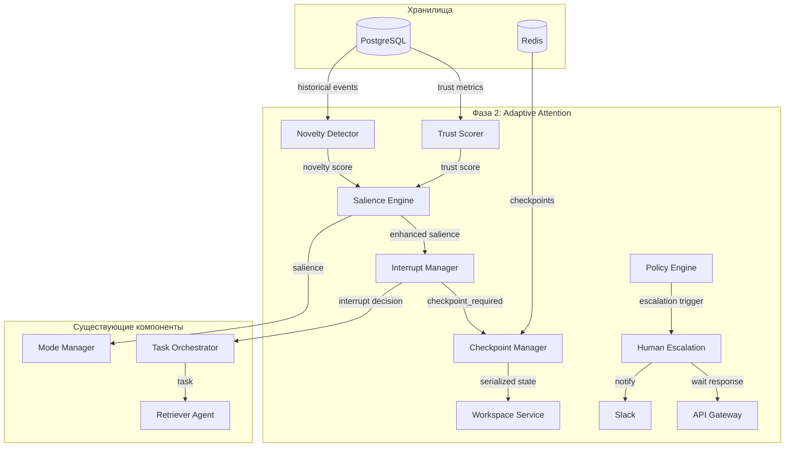

# Архитектурный план фазы 2: Adaptive Attention

## Обзор

Фаза 2 расширяет возможности RAS-like оркестратора четырьмя ключевыми компонентами, обеспечивающими адаптивное внимание:

1. **Novelty detection** – обнаружение новых/аномальных паттернов на основе исторических событий
2. **Checkpoint/resume** – механизм сохранения и восстановления состояния длительных задач
3. **Trust scoring** – оценка доверия к источникам событий
4. **Human escalation workflows** – рабочие процессы эскалации к человеку-оператору

Эти компоненты интегрируются в существующую архитектуру, усиливая способности системы к селективному вниманию и прерыванию.

## Текущая архитектура (кратко)

- **Микросервисная событийная архитектура** с Apache Kafka в качестве шины
- **Компоненты**: API Gateway, Salience Engine, Mode Manager, Interrupt Manager, Task Orchestrator, Retriever Agent, Workspace Service, Policy Engine, Observability Stack
- **Хранилища**: Redis (рабочее пространство), PostgreSQL (опционально, для персистентности)
- **Поток данных**: Событие → Salience Engine → Mode Manager / Interrupt Manager → Task Orchestrator → Агент → Workspace

## 1. Novelty Detection

### Назначение
Вычисление метрики новизны (novelty) события на основе исторических паттернов, что позволяет Salience Engine точнее оценивать значимость.

### Архитектурный дизайн

#### Модульная структура
```
ras_orchestrator/salience_engine/
├── novelty_detector.py          # Основной класс детектора новизны
├── historical_repository.py     # Абстракция для доступа к историческим событиям
└── patterns/                    # Алгоритмы обнаружения паттернов
    ├── frequency_based.py
    ├── time_series.py
    └── clustering.py
```

#### Интеграция с существующими компонентами
- **Salience Engine**: Модифицировать метод `_compute_novelty` в `engine.py` для использования `NoveltyDetector`
- **Workspace Service**: Расширить для хранения агрегированных исторических метрик в Redis (кеш)
- **PostgreSQL**: Для долгосрочного хранения сырых событий и извлечения паттернов

#### API интерфейсы и схемы данных
```python
# В common/models.py добавить
class HistoricalEvent(BaseModel):
    event_id: str
    type: EventType
    severity: Severity
    source: str
    timestamp: datetime
    payload: Dict[str, Any]
    novelty_score: Optional[float] = None

class NoveltyDetector:
    def compute_novelty(event: Event, history_window: timedelta = timedelta(days=7)) -> float:
        """Возвращает оценку новизны от 0.0 (частое) до 1.0 (уникальное)"""
```

#### Поток данных
1. Salience Engine при вычислении novelty запрашивает HistoricalRepository
2. HistoricalRepository извлекает события из PostgreSQL за заданный период
3. NoveltyDetector применяет алгоритмы (частота, кластеризация, временные ряды)
4. Результат кэшируется в Redis для быстрого доступа

#### Новые файлы / модификации
- `ras_orchestrator/salience_engine/novelty_detector.py` (новый)
- `ras_orchestrator/salience_engine/historical_repository.py` (новый)
- `ras_orchestrator/salience_engine/engine.py` – модификация `_compute_novelty`
- `ras_orchestrator/common/models.py` – добавление HistoricalEvent
- `ras_orchestrator/workspace_service/redis_client.py` – методы для кэша novelty
- `docker-compose.yml` – добавление PostgreSQL (если ещё нет)

## 2. Checkpoint/Resume

### Назначение
Сохранение состояния длительных задач для возможности прерывания и последующего возобновления.

### Архитектурный дизайн

#### Модульная структура
```
ras_orchestrator/task_orchestrator/
├── checkpoint_manager.py        # Управление чекпоинтами
├── serialization.py             # Сериализация состояния (pickle, JSON)
└── resume_orchestrator.py       # Восстановление задач
ras_orchestrator/interrupt_manager/
└── checkpoint_integration.py    # Интеграция с InterruptManager
```

#### Интеграция с существующими компонентами
- **Task Orchestrator**: Расширить для поддержки чекпоинтов перед прерыванием
- **Interrupt Manager**: При принятии решения о прерывании с `checkpoint_required=True` вызывать CheckpointManager
- **Workspace Service**: Хранение сериализованного состояния в Redis (с TTL) или PostgreSQL (для долгосрочности)
- **Retriever Agent**: Агенты должны реализовать интерфейс `Checkpointable` для сериализации своего состояния

#### API интерфейсы и схемы данных
```python
# В common/models.py добавить
class TaskCheckpoint(BaseModel):
    checkpoint_id: str
    task_id: str
    agent_type: str
    state_data: bytes  # pickle-сериализованное состояние
    created_at: datetime
    expires_at: Optional[datetime]

class CheckpointManager:
    def save_checkpoint(task: Task, agent_state: Any) -> str:
    def load_checkpoint(checkpoint_id: str) -> Tuple[Task, Any]:
```

#### Поток данных
1. Interrupt Manager определяет необходимость чекпоинта
2. CheckpointManager запрашивает состояние у агента через Task Orchestrator
3. Состояние сериализуется (pickle) и сохраняется в Workspace Service
4. При возобновлении CheckpointManager загружает состояние и передаёт агенту

#### Новые файлы / модификации
- `ras_orchestrator/task_orchestrator/checkpoint_manager.py` (новый)
- `ras_orchestrator/task_orchestrator/serialization.py` (новый)
- `ras_orchestrator/task_orchestrator/resume_orchestrator.py` (новый)
- `ras_orchestrator/interrupt_manager/checkpoint_integration.py` (новый)
- `ras_orchestrator/retriever_agent/agent.py` – добавление методов `get_state()`, `set_state()`
- `ras_orchestrator/common/models.py` – добавление TaskCheckpoint

## 3. Trust Scoring

### Назначение
Оценка доверия к источнику события на основе исторической точности, репутации и консистентности.

### Архитектурный дизайн

#### Модульная структура
```
ras_orchestrator/salience_engine/
├── trust_scorer.py              # Вычисление trust score
└── source_registry.py           # Реестр источников с метриками
```

#### Интеграция с существующими компонентами
- **Salience Engine**: Trust score влияет на оценку relevance и risk
- **Policy Engine**: Политики могут использовать trust score для фильтрации событий
- **Workspace Service**: Хранение метрик источников (score, количество событий, accuracy)
- **PostgreSQL**: Для персистентного хранения истории trust score

#### API интерфейсы и схемы данных
```python
# В common/models.py добавить
class SourceTrust(BaseModel):
    source: str
    trust_score: float = 0.5  # 0.0 – недоверенный, 1.0 – доверенный
    events_count: int = 0
    accuracy: float = 1.0     # Точность предыдущих предсказаний
    last_updated: datetime

class TrustScorer:
    def compute_trust(source: str, event: Event, ground_truth: Optional[Dict] = None) -> float:
```

#### Поток данных
1. При поступлении события Salience Engine запрашивает trust score для источника
2. TrustScorer вычисляет score на основе исторических данных (регрессия, Bayesian updating)
3. Score используется для корректировки relevance и risk в salience computation
4. При наличии ground truth (последующее подтверждение) trust score обновляется

#### Новые файлы / модификации
- `ras_orchestrator/salience_engine/trust_scorer.py` (новый)
- `ras_orchestrator/salience_engine/source_registry.py` (новый)
- `ras_orchestrator/salience_engine/engine.py` – модификация `_compute_relevance` и `_compute_risk`
- `ras_orchestrator/common/models.py` – добавление SourceTrust
- `ras_orchestrator/policy_engine/schemas.py` – добавление условия trust_score

## 4. Human Escalation Workflows

### Назначение
Автоматическая эскалация событий к человеку-оператору через настраиваемые workflows с уведомлениями и ожиданием ответа.

### Архитектурный дизайн

#### Модульная структура
```
ras_orchestrator/human_escalation/
├── workflow_engine.py           # Движок workflows
├── notifier.py                  # Отправка уведомлений (Slack, email, etc.)
├── escalation_manager.py        # Управление эскалациями
└── models.py                    # Модели эскалации
```

#### Интеграция с существующими компонентами
- **Policy Engine**: Политики human_escalation запускают workflows
- **Task Orchestrator**: Эскалации могут создавать задачи для операторов
- **Workspace Service**: Хранение состояния эскалаций (ожидание ответа, таймауты)
- **API Gateway**: REST endpoint для ответов оператора

#### API интерфейсы и схемы данных
```python
# В common/models.py добавить
class EscalationWorkflow(BaseModel):
    workflow_id: str
    trigger_policy: str
    steps: List[EscalationStep]
    timeout_seconds: int
    notify_channels: List[str]  # slack, email, pagerduty

class EscalationStep:
    action: str  # notify, wait_for_response, execute_script
    parameters: Dict[str, Any]

class HumanEscalationManager:
    def start_workflow(trigger_event: Event, policy: Dict) -> str:
    def handle_human_response(workflow_id: str, response: Dict):
```

#### Поток данных
1. Policy Engine обнаруживает условие, требующее эскалации
2. EscalationManager создаёт workflow, сохраняет состояние в Workspace
3. Notifier отправляет уведомления через настроенные каналы (Slack, email)
4. Система ожидает ответа оператора через REST endpoint или таймаут
5. По получении ответа workflow продолжается или завершается

#### Новые файлы / модификации
- `ras_orchestrator/human_escalation/` (новая директория)
- `ras_orchestrator/human_escalation/workflow_engine.py` (новый)
- `ras_orchestrator/human_escalation/notifier.py` (новый)
- `ras_orchestrator/human_escalation/escalation_manager.py` (новый)
- `ras_orchestrator/human_escalation/models.py` (новый)
- `ras_orchestrator/api_gateway/main.py` – добавление endpoint `/escalation/response`
- `ras_orchestrator/policy_engine/engine.py` – интеграция триггеров эскалации

## Интеграционный план

### Последовательность реализации

1. **Подготовка инфраструктуры**
   - Настройка PostgreSQL для historical events
   - Расширение docker-compose.yml
   - Создание миграций базы данных

2. **Novelty Detection**
   - Реализация HistoricalRepository и NoveltyDetector
   - Интеграция с Salience Engine
   - Написание тестов

3. **Checkpoint/Resume**
   - Реализация CheckpointManager и сериализации
   - Модификация Retriever Agent для поддержки состояния
   - Интеграция с Interrupt Manager
   - Тестирование прерывания и возобновления

4. **Trust Scoring**
   - Реализация TrustScorer и SourceRegistry
   - Интеграция с Salience Engine
   - Добавление политик на основе trust score
   - Тестирование на исторических данных

5. **Human Escalation Workflows**
   - Реализация WorkflowEngine и Notifier
   - Интеграция с Policy Engine
   - Добавление REST endpoint для ответов оператора
   - Настройка уведомлений (Slack, email)

6. **Интеграционное тестирование**
   - End-to-end сценарии с использованием всех четырёх компонентов
   - Нагрузочное тестирование
   - Документация и примеры использования

### Новые зависимости
- `psycopg2-binary` – для работы с PostgreSQL
- `slack-sdk` – для уведомлений в Slack
- `pickle` – встроенная, но потребуется безопасная сериализация
- `croniter` – для планирования проверок historical events

### Модификации существующих файлов
- `ras_orchestrator/common/models.py` – добавление новых моделей
- `ras_orchestrator/salience_engine/engine.py` – обновление методов вычисления novelty, relevance, risk
- `ras_orchestrator/task_orchestrator/orchestrator.py` – добавление поддержки чекпоинтов
- `ras_orchestrator/interrupt_manager/manager.py` – интеграция с checkpoint_required
- `ras_orchestrator/policy_engine/engine.py` – поддержка триггеров эскалации
- `ras_orchestrator/api_gateway/main.py` – новые endpoints
- `ras_orchestrator/docker-compose.yml` – добавление PostgreSQL и, возможно, RabbitMQ для уведомлений
- `ras_orchestrator/requirements.txt` – новые зависимости

## Диаграмма архитектуры фазы 2



## Заключение

Предложенная архитектура фазы 2 обеспечивает:

- **Адаптивное внимание** через novelty detection и trust scoring
- **Устойчивость к прерываниям** через checkpoint/resume
- **Контроль человека в цикле** через гибкие workflows эскалации

Все компоненты спроектированы как модульные расширения существующей системы, что минимизирует риски рефакторинга и позволяет внедрять их поэтапно.

План реализации готов для делегирования в режим Code.