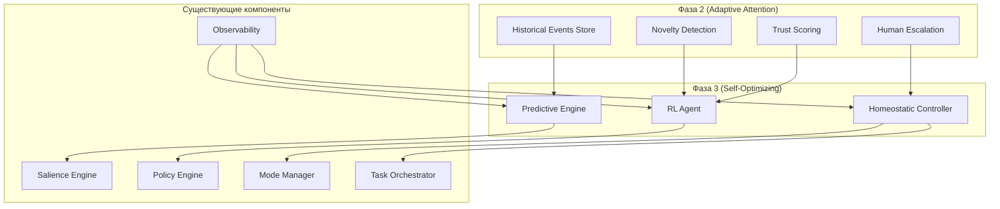
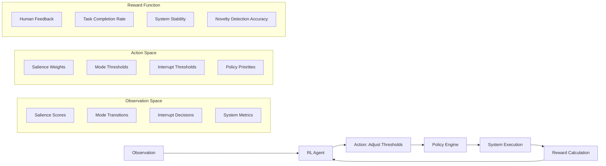
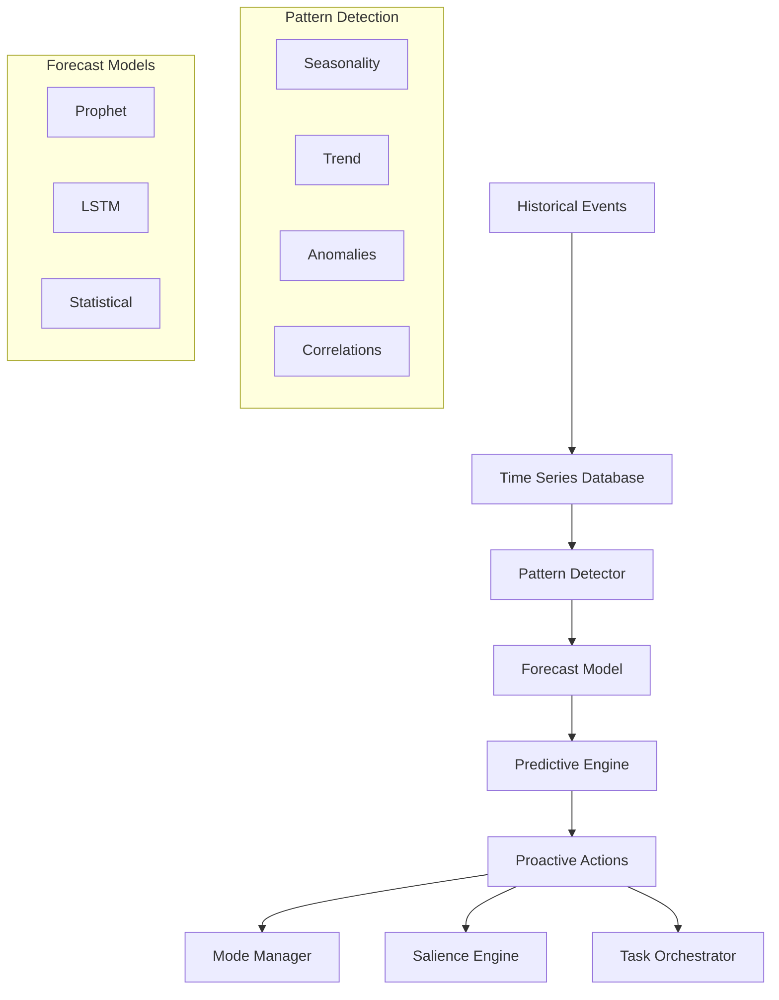
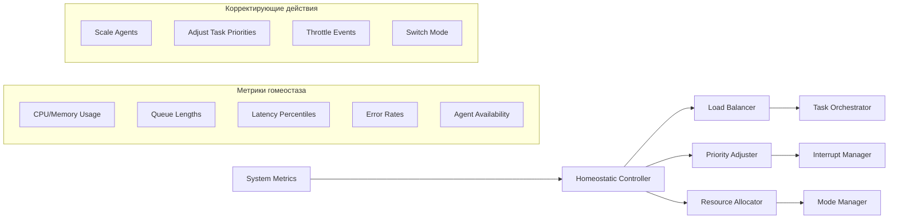
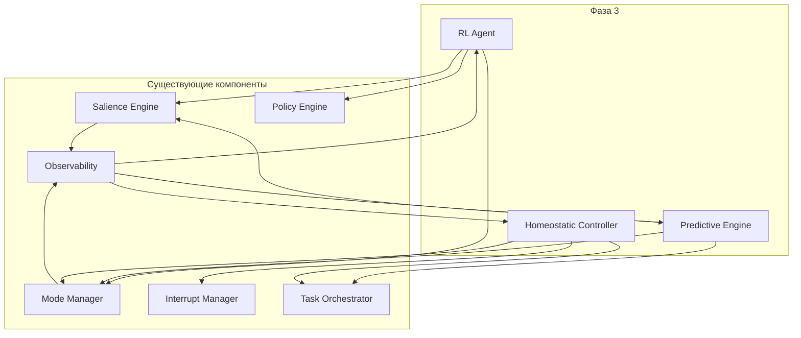

# Архитектурный план фазы 3: Self-Optimizing RAS-like Orchestrator

## Введение

Фаза 3 (Self-Optimizing) расширяет возможности RAS-like оркестратора за счёт автоматической адаптации к изменяющимся условиям, прогнозирования будущих событий и поддержания гомеостаза системы. Цель — превратить оркестратор из реактивной системы в проактивную, способную самооптимизироваться на основе накопленного опыта и текущих метрик.

**Предположение**: Фаза 2 (Adaptive Attention) уже реализована, включая:
- Novelty detection на основе historical events
- Checkpoint/resume для длинных задач
- Trust scoring для источников событий
- Human escalation workflows

## Обзор фазы 3

Фаза 3 состоит из трёх ключевых компонентов:

1. **Reinforcement Learning (RL) для динамической настройки порогов** — автоматическая корректировка порогов значимости, режимов и прерываний на основе обратной связи от результатов решений.
2. **Predictive processing на основе временных паттернов** — анализ исторических событий для прогнозирования будущих инцидентов и предварительной настройки системы.
3. **Homeostatic control для баланса нагрузки** — поддержание стабильного состояния системы через регулировку нагрузки, приоритетов и распределения ресурсов.

### Высокоуровневая архитектура



## Зависимости от фазы 2

| Компонент фазы 2 | Использование в фазе 3 |
|------------------|------------------------|
| **Historical Events Store** | Источник данных для predictive processing и RL обучения |
| **Novelty Detection** | Базовый сигнал для RL reward (новизна как показатель эффективности) |
| **Trust Scoring** | Весовой коэффициент для RL (более доверенным источникам выше вес) |
| **Human Escalation Workflows** | Источник обратной связи для RL (решения человека как ground truth) |
| **Checkpoint/Resume** | Поддержка длительных RL-эпизодов и восстановления состояния |

## Компонент 1: Reinforcement Learning для динамической настройки порогов

### Назначение
Автоматическая адаптация пороговых значений в Policy Engine, Salience Engine и Mode Manager на основе накопленного опыта (reward). RL агент учится минимизировать ложные срабатывания и максимизировать эффективность прерываний.

### Архитектура



### Модульная структура

**Новые файлы:**
- `ras_orchestrator/rl_agent/__init__.py`
- `ras_orchestrator/rl_agent/agent.py` — основной RL агент (алгоритм DQN или PPO)
- `ras_orchestrator/rl_agent/environment.py` — среда взаимодействия с оркестратором
- `ras_orchestrator/rl_agent/reward_calculator.py` — вычисление reward на основе метрик
- `ras_orchestrator/rl_agent/policy_integration.py` — интеграция с Policy Engine
- `ras_orchestrator/rl_agent/models.py` — Pydantic модели для состояний и действий
- `ras_orchestrator/rl_agent/consumer.py` — Kafka consumer для сбора observations

**Модификации существующих:**
- `ras_orchestrator/policy_engine/core.py` — добавление динамических порогов через RL
- `ras_orchestrator/salience_engine/engine.py` — поддержка весов от RL
- `ras_orchestrator/mode_manager/manager.py` — корректировка порогов переходов
- `ras_orchestrator/common/models.py` — добавление RLState, RLAction

### API интерфейсы

```python
# models.py
class RLState(BaseModel):
    timestamp: datetime
    salience_scores: List[float]
    current_mode: SystemMode
    interrupt_decisions: List[InterruptDecision]
    system_metrics: SystemMetrics

class RLAction(BaseModel):
    action_type: Literal["adjust_salience_weights", "adjust_mode_thresholds", "adjust_interrupt_thresholds"]
    parameters: Dict[str, float]

# agent.py
class RLAgent:
    async def observe(state: RLState) -> RLAction
    async def learn(episode: List[Tuple[RLState, RLAction, float]])
```

### Поток данных
1. Система собирает observations (салиенс, режимы, решения) и отправляет в топик `ras.rl.observations`.
2. RL Agent потребляет observations, выбирает действие (настройка порогов).
3. Действие применяется к Policy Engine через `policy_integration`.
4. Система работает с новыми порогами, результаты фиксируются в метриках.
5. Reward Calculator вычисляет reward на основе метрик и human feedback.
6. RL Agent обновляет политику через learning цикл (offline или online).

### Алгоритм RL
- **Алгоритм**: DQN (Deep Q-Network) для дискретного пространства действий, PPO для непрерывного.
- **Обучение**: Offline на исторических данных + online fine-tuning.
- **Частота обновления**: Каждые 1000 событий или раз в час.

## Компонент 2: Predictive processing на основе временных паттернов

### Назначение
Прогнозирование будущих событий и проактивная настройка системы на основе анализа временных паттернов исторических событий.

### Архитектура



### Модульная структура

**Новые файлы:**
- `ras_orchestrator/predictive_engine/__init__.py`
- `ras_orchestrator/predictive_engine/engine.py` — основной движок прогнозирования
- `ras_orchestrator/predictive_engine/pattern_detector.py` — обнаружение паттернов
- `ras_orchestrator/predictive_engine/forecast_models.py` — модели прогнозирования
- `ras_orchestrator/predictive_engine/timeseries_store.py` — клиент к БД временных рядов
- `ras_orchestrator/predictive_engine/consumer.py` — потребление historical events
- `ras_orchestrator/predictive_engine/proactive_actions.py` — генерация проактивных действий

**Модификации существующих:**
- `ras_orchestrator/common/models.py` — добавление Forecast, Pattern
- `ras_orchestrator/salience_engine/advanced_scoring.py` — использование прогнозов для novelty
- `ras_orchestrator/mode_manager/manager.py` — предварительный переход режима на основе прогноза
- `ras_orchestrator/observability/prometheus.yml` — метрики прогнозов

### Хранилище временных рядов
- **Технология**: TimescaleDB (расширение PostgreSQL) или InfluxDB.
- **Схема**: `(timestamp, event_type, severity, source, salience_aggregated, ...)`
- **Удержание данных**: 90 дней для детальных данных, 1 год для агрегированных.

### Прогнозные модели
1. **Prophet** — для сезонности и трендов.
2. **LSTM** — для сложных временных зависимостей.
3. **Статистические модели** (ARIMA, Exponential Smoothing) — для быстрых прогнозов.

### Поток данных
1. Historical Events из фазы 2 записываются в TimescaleDB.
2. Pattern Detector анализирует данные, выявляет сезонность, тренды, аномалии.
3. Forecast Model генерирует прогноз на следующие N часов (например, вероятность critical событий).
4. Predictive Engine оценивает прогноз и принимает решение о проактивных действиях:
   - Предварительное повышение режима системы.
   - Увеличение веса novelty для ожидаемых типов событий.
   - Подготовка агентов к возможным задачам.
5. Действия применяются к соответствующим компонентам.

### API интерфейсы
```python
class ForecastRequest(BaseModel):
    event_type: Optional[EventType]
    horizon_hours: int = 24
    confidence_level: float = 0.8

class ForecastResponse(BaseModel):
    predictions: List[PredictionPoint]
    confidence_interval: Tuple[float, float]
    recommended_actions: List[ProactiveAction]
```

## Компонент 3: Homeostatic control для баланса нагрузки

### Назначение
Поддержание гомеостаза системы через динамическую балансировку нагрузки, регулировку приоритетов задач и распределение ресурсов между компонентами.

### Архитектура



### Модульная структура

**Новые файлы:**
- `ras_orchestrator/homeostatic_controller/__init__.py`
- `ras_orchestrator/homeostatic_controller/controller.py` — основной контроллер
- `ras_orchestrator/homeostatic_controller/metrics_collector.py` — сбор метрик системы
- `ras_orchestrator/homeostatic_controller/load_balancer.py` — балансировка нагрузки
- `ras_orchestrator/homeostatic_controller/priority_manager.py` — управление приоритетами
- `ras_orchestrator/homeostatic_controller/resource_allocator.py` — распределение ресурсов
- `ras_orchestrator/homeostatic_consumer.py` — потребление метрик и событий

**Модификации существующих:**
- `ras_orchestrator/task_orchestrator/orchestrator.py` — поддержка динамического масштабирования агентов
- `ras_orchestrator/interrupt_manager/manager.py` — приоритизация прерываний на основе нагрузки
- `ras_orchestrator/mode_manager/manager.py` — корректировка режима на основе метрик гомеостаза
- `ras_orchestrator/workspace_service/redis_client.py` — кэширование состояния гомеостаза

### Принципы гомеостаза
1. **Стабильность**: Поддержание ключевых метрик в целевых диапазонах (например, latency < 200ms, error rate < 1%).
2. **Адаптивность**: Плавная корректировка параметров без резких колебаний.
3. **Приоритизация**: Критические задачи получают ресурсы в ущерб фоновым.

### Механизмы балансировки
- **Динамическое масштабирование агентов**: Запуск/остановка экземпляров Retriever Agent в зависимости от длины очереди задач.
- **Приоритизация прерываний**: В условиях высокой нагрузки повышается порог для non-critical прерываний.
- **Throttling событий**: Ограничение частоты событий от менее важных источников.
- **Регулировка режима**: При высокой нагрузке система может временно перейти в elevated режим, даже если salience не превышает порог.

### Поток данных
1. Metrics Collector собирает метрики из Prometheus, Redis, Kafka.
2. Homeostatic Controller анализирует метрики, вычисляет отклонения от целевых значений.
3. При превышении допустимых отклонений генерируется корректирующее действие.
4. Действие применяется к соответствующему компоненту (например, Load Balancer масштабирует агентов).
5. Эффект действия отслеживается через метрики, образуя замкнутый цикл.

### API интерфейсы
```python
class HomeostaticState(BaseModel):
    timestamp: datetime
    metrics: Dict[str, float]
    target_ranges: Dict[str, Tuple[float, float]]
    current_actions: List[ControlAction]

class ControlAction(BaseModel):
    component: Literal["task_orchestrator", "interrupt_manager", "mode_manager"]
    action_type: str
    parameters: Dict[str, Any]
```

## Интеграционный план

### Взаимодействие компонентов фазы 3



### Топики Kafka
- `ras.rl.observations` — observations для RL агента
- `ras.rl.actions` — действия RL агента
- `ras.predictive.forecasts` — прогнозы от Predictive Engine
- `ras.homeostatic.metrics` — метрики гомеостаза
- `ras.homeostatic.actions` — корректирующие действия

### Зависимости от внешних сервисов
- **TimescaleDB/InfluxDB** — хранилище временных рядов для predictive processing.
- **MLflow/Weights & Biases** — трекинг экспериментов RL.
- **Kubernetes Horizontal Pod Autoscaler** — для масштабирования агентов (опционально).

## Новые файлы и модификации

### Новые директории и файлы
```
ras_orchestrator/
├── rl_agent/
│   ├── __init__.py
│   ├── agent.py
│   ├── environment.py
│   ├── reward_calculator.py
│   ├── policy_integration.py
│   ├── models.py
│   ├── consumer.py
│   └── tests/
├── predictive_engine/
│   ├── __init__.py
│   ├── engine.py
│   ├── pattern_detector.py
│   ├── forecast_models.py
│   ├── timeseries_store.py
│   ├── consumer.py
│   ├── proactive_actions.py
│   └── tests/
├── homeostatic_controller/
│   ├── __init__.py
│   ├── controller.py
│   ├── metrics_collector.py
│   ├── load_balancer.py
│   ├── priority_manager.py
│   ├── resource_allocator.py
│   ├── consumer.py
│   └── tests/
└── integration/
    └── phase3_coordinator.py
```

### Модификации существующих файлов
1. **common/models.py** — добавление новых моделей:
   - `RLState`, `RLAction`
   - `Forecast`, `Pattern`
   - `HomeostaticState`, `ControlAction`
   - `SystemMetrics` расширение

2. **policy_engine/core.py** — поддержка динамических порогов через RL:
   - Добавление метода `apply_rl_adjustments(adjustments: Dict[str, float])`
   - Модификация `evaluate` для использования обновлённых порогов

3. **salience_engine/engine.py** — интеграция с predictive engine:
   - Использование прогнозов для корректировки novelty
   - Веса от RL агента

4. **mode_manager/manager.py** — расширение для гомеостатического контроля:
   - Метод `adjust_for_homeostasis(metrics: SystemMetrics)`
   - Учёт прогнозов при переходе режимов

5. **task_orchestrator/orchestrator.py** — динамическое масштабирование:
   - Метод `scale_agents(count: int)`
   - Интеграция с load balancer

6. **observability/prometheus.yml** — новые метрики:
   - `ras_rl_reward`
   - `ras_predictive_accuracy`
   - `ras_homeostatic_deviation`

7. **docker-compose.yml** — добавление сервисов:
   - timescaledb (расширение postgres)
   - mlflow (для трекинга RL экспериментов)

## Последовательность реализации

### Этап 1: Подготовка инфраструктуры
1. Добавить TimescaleDB в docker-compose.
2. Создать схемы БД для historical events и временных рядов.
3. Настроить MLflow для трекинга экспериментов.
4. Обновить requirements.txt: добавить `stable-baselines3`, `prophet`, `torch`, `timescale`.

### Этап 2: Predictive Engine (наиболее независимый)
1. Реализовать `timeseries_store.py` с клиентом к TimescaleDB.
2. Реализовать `pattern_detector.py` с базовыми статистическими методами.
3. Реализовать `forecast_models.py` с моделью Prophet.
4. Реализовать `predictive_engine/engine.py` как координатор.
5. Интегрировать с Salience Engine для novelty корректировки.
6. Написать тесты, проверить на исторических данных.

### Этап 3: Homeostatic Controller
1. Реализовать `metrics_collector.py` для сбора метрик из Prometheus/Redis.
2. Реализовать `controller.py` с ПИД-регулятором или простыми правилами.
3. Реализовать `load_balancer.py` и `priority_manager.py`.
4. Интегрировать с Task Orchestrator и Interrupt Manager.
5. Протестировать на симулированной нагрузке.

### Этап 4: Reinforcement Learning Agent
1. Реализовать `environment.py` — среду взаимодействия с оркестратором.
2. Реализовать `reward_calculator.py` на основе метрик и human feedback.
3. Реализовать `agent.py` с DQN/PPO (используя stable-baselines3).
4. Реализовать `policy_integration.py` для применения действий к Policy Engine.
5. Настроить offline обучение на исторических данных.
6. Постепенно включить online fine-tuning.

### Этап 5: Интеграция и тестирование
1. Реализовать `phase3_coordinator.py` для координации всех трёх компонентов.
2. Настроить топики Kafka и consumers.
3. Провести end-to-end тестирование сценариев:
   - Прогнозирование всплеска событий и проактивное действие.
   - Автоматическая настройка порогов RL агентом.
   - Балансировка нагрузки при высокой загруженности.
4. Написать интеграционные тесты.
5. Документировать API и конфигурацию.

### Этап 6: Постепенное внедрение
1. Включить predictive engine в monitoring-only режим (только логирование прогнозов).
2. Включить homeostatic controller с ограниченным набором действий.
3. Запустить RL агента в shadow mode (действия не применяются, только логируются).
4. После валидации постепенно переводить компоненты в active mode.

## Риски и рекомендации

### Риски
1. **Производительность**: Predictive engine и RL обучение могут потреблять значительные ресурсы. Рекомендуется вынести тяжёлые вычисления в отдельные воркеры.
2. **Стабильность**: Неправильные действия RL агента могут дестабилизировать систему. Необходимы safeguard-механизмы (ограничения, rollback).
3. **Качество данных**: Predictive engine зависит от качества historical events. Нужна валидация и очистка данных.
4. **Сложность отладки**: Система с тремя самооптимизирующимися компонентами сложна для отладки. Необходимо расширенное логирование и трассировка.

### Рекомендации
1. **Feature flags**: Для каждого компонента реализовать feature flags для постепенного включения.
2. **A/B тестирование**: Сравнивать эффективность RL-оптимизированных порогов с базовыми.
3. **Human-in-the-loop**: Критические действия (например, переход в critical режим) должны требовать подтверждения человека на первых этапах.
4. **Мониторинг**: Расширить Grafana дашборды для отслеживания метрик фазы 3.

## Заключение

Предложенная архитектура фазы 3 превращает RAS-like оркестратор в самооптимизирующуюся систему, способную прогнозировать события, адаптировать пороги на основе опыта и поддерживать гомеостаз под нагрузкой. Реализация разбита на независимые компоненты с чёткими интерфейсами, что позволяет разрабатывать и внедрять их поэтапно.

План готов для делегирования реализации в режиме Code.